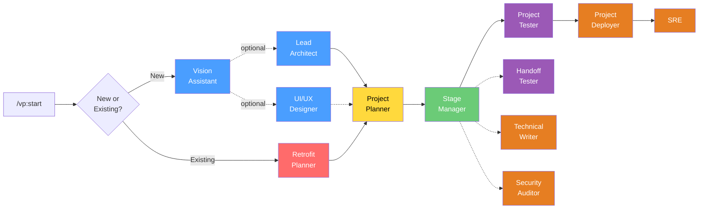
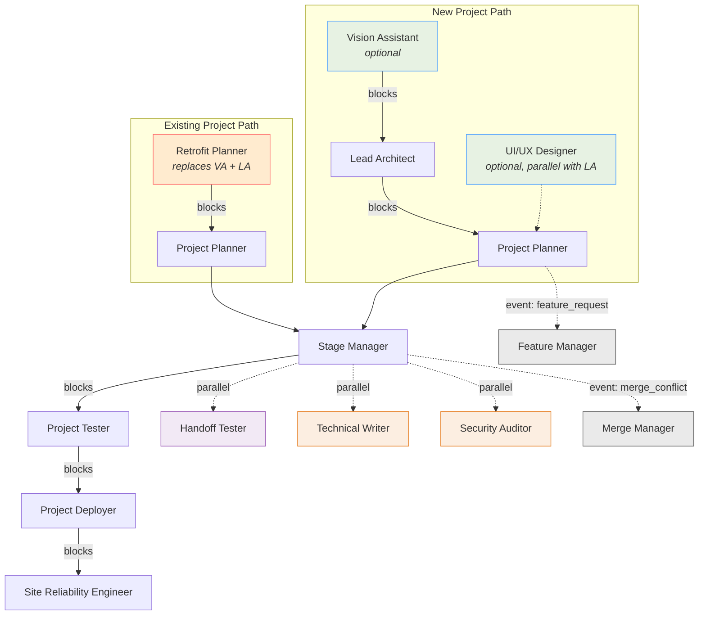
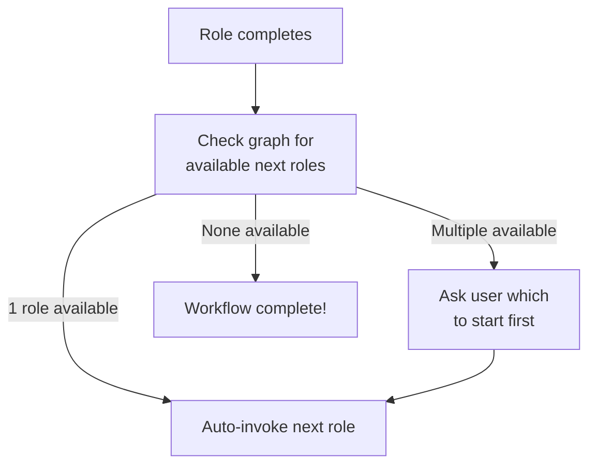

# VibeOps

AI-orchestrated development framework with 16 specialized roles for Claude Code, OpenCode, Gemini CLI, and Codex.

VibeOps turns a rough idea into a deployed, tested, documented project through a dependency-driven pipeline of AI roles — each with a focused responsibility, the right model for the job, and automatic handoffs to the next step.

```
npx spec-driven-devops --claude
```

## How It Works

Instead of one giant prompt, VibeOps breaks development into **16 specialized roles** organized in a dependency graph. Each role produces specific outputs that feed into the next. The workflow auto-chains — when one role finishes, the next one starts automatically.



**Dashed lines** = optional or parallel. **Solid lines** = required dependency.

## Quick Start

### Install

```bash
# Claude Code
npx spec-driven-devops --claude

# OpenCode
npx spec-driven-devops --opencode

# Gemini CLI
npx spec-driven-devops --gemini

# Codex CLI
npx spec-driven-devops --codex

# All runtimes
npx spec-driven-devops --all
```

### Run

Open your AI coding tool and start the workflow:

```
/vp:start
```

That's it. The framework asks if you're building something new or enhancing an existing project, initializes tracking, and auto-chains through the roles.

### Skip Ahead

Already have a vision doc or architecture plan? Jump to any point:

```
/vp:start --from architect    # Skip vision, start at architecture
/vp:start --from plan         # Skip to planning (assumes architecture exists)
/vp:start --from build        # Skip to building (assumes plan exists)
/vp:start existing --from plan  # Existing project, skip retrofit
```

## The 16 Roles

### Design Phase

| Role | Command | Description | Produces |
|------|---------|-------------|----------|
| Vision Assistant | `/vp:vision` | Explore and shape a rough idea into a clear vision | `vision-document.md` |
| Lead Architect | `/vp:architect` | Design architecture, tech stack, deployment strategy | `project-plan.md`, `deploy-instruct.md` |
| UI/UX Designer | `/vp:designer` | Define visual system, design tokens, UX patterns | `design-system.md` |
| Retrofit Planner | `/vp:retrofit` | Analyze existing codebase and plan changes | `project-plan.md`, `project-state.md` |

### Planning Phase

| Role | Command | Description | Produces |
|------|---------|-------------|----------|
| Project Planner | `/vp:plan` | Break project into implementable stages with contracts | `stage-instructions/`, `contracts/` |

### Implementation Phase

| Role | Command | Description | Produces |
|------|---------|-------------|----------|
| Stage Manager | `/vp:build` | Implement stages, manage branches, run parallel builds | Source code, tests |
| Merge Manager | `/vp:merge` | Resolve conflicts between parallel stage branches | Merge report |
| Feature Manager | `/vp:feature` | Assess mid-development feature requests | `feature-assessments/` |

### Testing Phase

| Role | Command | Description | Produces |
|------|---------|-------------|----------|
| Project Tester | `/vp:test` | Test pipelines, find and fix bugs | `tests/` reports |
| Handoff Tester | `/vp:handoff` | Document UX feedback with end users (no code editing) | `ux-feedback/` |

### Deployment Phase

| Role | Command | Description | Produces |
|------|---------|-------------|----------|
| Technical Writer | `/vp:docs` | Create README, API docs, user guides | `README.md`, `docs/` |
| Security Auditor | `/vp:security` | OWASP Top 10 review, dependency audit, secrets scan | `security-report.md` |
| Project Deployer | `/vp:deploy` | Deploy using deploy-instruct.md and MCP tools | Deployed application |
| SRE | `/vp:sre` | Monitoring, backups, recovery procedures | `recovery-plan.md` |

### Anytime

| Role | Command | Description | Produces |
|------|---------|-------------|----------|
| Codebase Mapper | `/vp:map` | Interactive HTML diagram of your codebase | `codebase-map.html` |

### Utility Commands

| Command | Description |
|---------|-------------|
| `/vp:start` | Initialize a new or existing project workflow |
| `/vp:status` | Show current workflow state and progress |
| `/vp:next` | Show dependency-aware next steps |
| `/vp:help` | List all commands with current state |

## Dependency Graph

The dependency engine handles two workflow paths, OR dependencies, role replacement, and parallel execution.



### Key Mechanics

- **OR dependencies**: Project Planner requires `lead-architect | retrofit-planner` — either one satisfies the dependency
- **Role replacement**: Retrofit Planner `replaces` Vision Assistant + Lead Architect for existing projects
- **Path filtering**: New projects see VA/LA/UXD; existing projects see RP. Common roles appear on both paths
- **Event-triggered roles**: Merge Manager activates on merge conflicts; Feature Manager activates on feature requests
- **Parallel execution**: Stage Manager supports multiple instances for independent stages

## Auto-Chaining

When a role completes, the workflow automatically continues:



You don't manually type `/vp:build` after `/vp:plan` finishes — it just happens. The entire pipeline from `/vp:start` to `/vp:sre` can run with minimal user intervention.

## Model Profiles

Each role is assigned a model based on the complexity of its task. Three profiles control the cost/capability tradeoff:

| Role | Quality | Balanced | Budget |
|------|---------|----------|--------|
| Lead Architect | opus | **opus** | sonnet |
| Retrofit Planner | opus | **opus** | sonnet |
| Project Planner | opus | **opus** | sonnet |
| Vision Assistant | opus | **sonnet** | haiku |
| UI/UX Designer | opus | **sonnet** | sonnet |
| Stage Manager | opus | **sonnet** | sonnet |
| Project Tester | opus | **sonnet** | sonnet |
| Security Auditor | opus | **sonnet** | sonnet |
| Merge Manager | opus | **sonnet** | sonnet |
| Project Deployer | sonnet | **sonnet** | sonnet |
| Technical Writer | sonnet | **sonnet** | haiku |
| Handoff Tester | sonnet | **sonnet** | haiku |
| Feature Manager | opus | **sonnet** | haiku |
| SRE | opus | **sonnet** | haiku |
| Codebase Mapper | sonnet | **haiku** | haiku |

**Bold** = recommended default (balanced profile). Override per-role in `vibration-plan/config.json`:

```json
{
  "model_profile": "balanced",
  "model_overrides": {
    "stage-manager": "opus"
  }
}
```

## Configuration

Three-tier config resolution (each layer overrides the previous):

1. **Hardcoded defaults** — sensible baseline
2. **User config** — `~/.vibeops/defaults.json` (applies to all projects)
3. **Project config** — `vibration-plan/config.json` (per-project)

### Key Settings

```json
{
  "model_profile": "balanced",
  "model_overrides": {},
  "workflow": {
    "auto_chain": true,
    "parallel_stages": true
  },
  "git": {
    "branching": "stage",
    "auto_commit": true,
    "commit_prefix": "vp:"
  },
  "gates": {
    "require_tests": true,
    "require_review": false
  }
}
```

## State Tracking

Every project gets a `vibration-plan/STATE.md` with machine-readable fields:

```markdown
**Path:** New Project
**Current Phase:** 3 - Implementation
**Status:** In Progress
**Active Roles:** stage-manager

## Role Checklist
- [x] Vision Assistant
- [x] Lead Architect
- [x] Project Planner
- [ ] Stage Manager
- [ ] Project Tester
- [ ] Project Deployer
- [ ] SRE
```

The `**Field:** value` pattern is both human-readable and regex-extractable. YAML frontmatter is auto-synced on every write for tooling integration.

## Multi-Runtime Support

VibeOps installs natively on four AI coding platforms:

| Runtime | Config Directory | Command Format |
|---------|-----------------|----------------|
| Claude Code | `~/.claude/` | YAML frontmatter markdown |
| OpenCode | `~/.config/opencode/` | Converted permissions format |
| Gemini CLI | `~/.gemini/` | Converted tool names |
| Codex CLI | `~/.codex/` | Skill format |

The installer automatically converts command formats, tool names, and permission models for each runtime. The same 16-role workflow runs identically across all platforms — useful for comparing model performance.

## Project Structure

```
vibration-plan-v2/
├── bin/
│   └── install.js              # Multi-runtime installer
├── commands/
│   └── vp/                     # 19 slash command files
│       ├── start.md
│       ├── vision.md
│       ├── architect.md
│       └── ...
├── hooks/
│   └── src/
│       ├── vp-statusline.js    # Progress bar in status line
│       ├── vp-context-monitor.js   # Context window warnings
│       └── vp-session-start.js # Auto-detect VP projects
├── vibeops/                    # Internals (copied to runtime config dir)
│   ├── bin/
│   │   ├── vp-tools.cjs       # CLI dispatcher
│   │   └── lib/
│   │       ├── core.cjs        # Model profiles, output helpers
│   │       ├── roles.cjs       # 16 role definitions
│   │       ├── graph.cjs       # Dependency engine
│   │       ├── state.cjs       # STATE.md operations
│   │       ├── config.cjs      # 3-tier config resolution
│   │       └── init.cjs        # Compound context-loading commands
│   ├── workflows/              # Execution workflows
│   ├── references/             # Dependency graph, model profiles
│   ├── templates/              # 12 output templates
│   └── agents/                 # Sub-agent definitions
├── tests/                      # 110 unit tests
├── scripts/
│   ├── run-tests.cjs
│   └── build-hooks.js
└── package.json
```

## CLI Tools

The `vp-tools.cjs` dispatcher provides programmatic access for commands and hooks:

```bash
# State management
vp-tools state load               # Load STATE.md
vp-tools state get <field>        # Get a field value
vp-tools state update <field> <value>
vp-tools state complete-role <id> --output <path>

# Dependency graph
vp-tools graph status             # Full graph visualization
vp-tools graph next               # Available next roles
vp-tools graph can-run <role-id>  # Check if a role can run

# Configuration
vp-tools config get <key>         # Dot notation: model_profile, git.branching
vp-tools config set <key> <value>

# Initialization
vp-tools init start               # Check for existing project
vp-tools init run-role <role-id>  # Validate deps, load context
vp-tools init build [stage-num]   # Load stage build context
```

## Testing

```bash
npm test
```

Runs 110 assertions across 4 test suites:
- **roles** — Role registry, lookups, path filtering, replacement, triggers
- **graph** — Dependency resolution, OR/AND deps, workflow progression
- **config** — Deep merge, dot notation access, 3-tier resolution
- **state** — Field extraction, frontmatter sync, role completion

## Uninstall

```bash
npx spec-driven-devops --claude --uninstall
```

Removes all commands, internals, hooks, and statusline config. Your project's `vibration-plan/` directory is untouched.

## License

MIT
